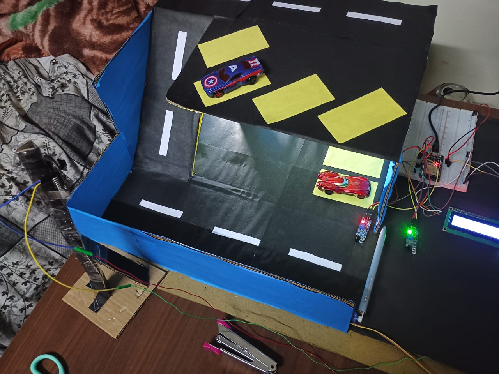
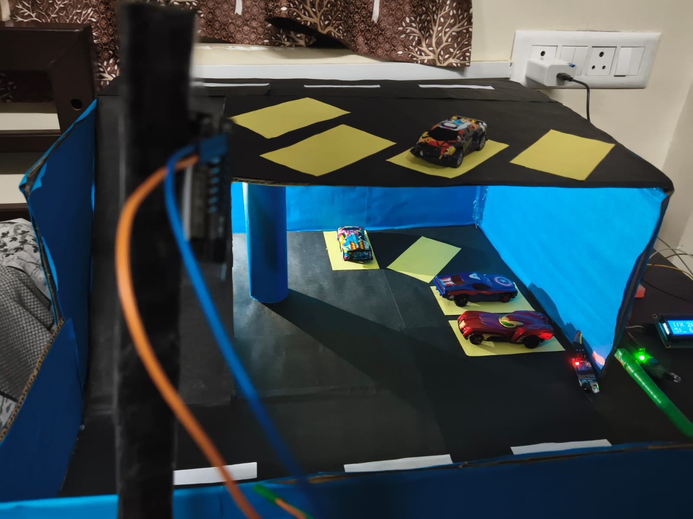
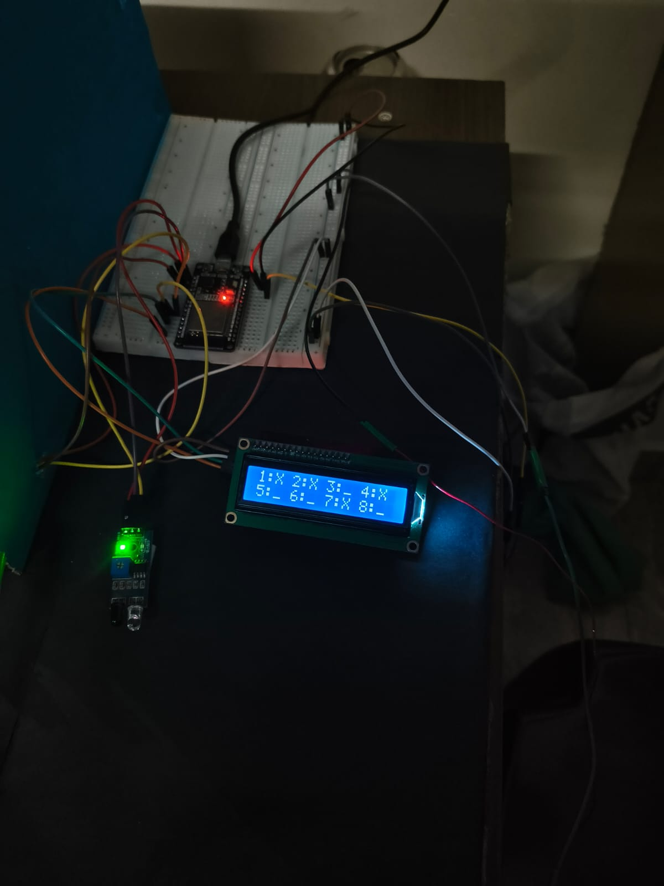
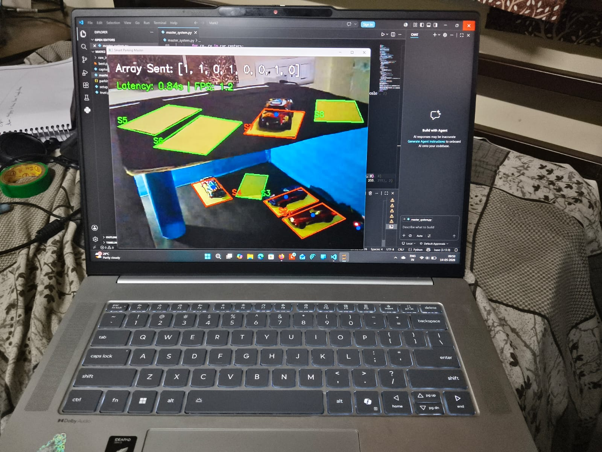

# 🚗 Smart Parking AI System 

An AI-driven, IoT-integrated smart parking solution designed for a sustainable future. 

Instead of relying on hundreds of expensive, physical ground sensors, this project uses a single overhead camera and a custom Machine Learning model to detect open parking slots in real-time.

## 🌱 The Sustainability Angle
Traditional smart parking systems require drilling into concrete to install toxic battery-powered ultrasonic sensors and heavy copper wiring in every single parking bay. 

Our approach is a **"green" software-first alternative**. By tapping into existing camera infrastructure and using lightweight edge AI, we drastically reduce electronic waste, manufacturing emissions, and installation costs. Furthermore, by efficiently guiding drivers to open slots via digital displays, we reduce engine idling time and carbon emissions in enclosed garages.

## 🚀 Enterprise Scalability
While this repository demonstrates the architecture using an ESP32-CAM prototype, the software pipeline is infinitely scalable. 
* **Zero Hardware Per-Slot:** To scale a traditional system to 1,000 parking spots, you must buy and maintain 1,000 physical sensors. With this architecture, 1,000 spots simply means drawing 1,000 digital polygons in the JSON file. 
* **CCTV Integration:** For enterprise deployment, the camera URL can be replaced with standard RTSP streams from pre-installed security cameras. 
* **Centralized Processing:** A single centralized GPU server can process streams from dozens of cameras simultaneously, creating a massive, city-wide IoT network with minimal physical infrastructure.

---

## 🏗️ System Architecture

### 1. 👀 The Eyes (Data Collection)
An **ESP32-CAM** module is mounted above the parking lot. To ensure network stability and conserve bandwidth, it captures periodic high-resolution images via a REST API rather than maintaining a heavy, continuous video stream.

### 2. 🧠 The Brain (AI & Logic)
A central Python server pulls the camera feed and runs the **YOLOv8** model to detect vehicles. It calculates the center pixel of each car and uses a Ray-Casting algorithm (`cv2.pointPolygonTest`) to check if that pixel falls inside our pre-mapped parking slot coordinates. It generates a real-time state array (e.g., `[1, 0, 0, 1]`).

### 3. ✋ The Hands (Hardware Output)
The server transmits the state array over the local Wi-Fi network to a **secondary ESP32** stationed at the entrance gate. This microcontroller manages an IR-triggered servo motor to open the barrier and updates an I2C LCD screen to guide drivers to the exact open slots.

---

## 💻 The Codebase (How to Use)

This repository provides a complete toolkit to build your own custom AI parking system from scratch.

### 0. Hardware Setup
Before running the Python scripts, you must prepare the microcontrollers:
* **Camera:** Flash your ESP32-CAM using the standard `CameraWebServer` example found built-in to the Arduino IDE (ensure you update the Wi-Fi credentials).
* **Gate & Display:** Flash your secondary ESP32 with the `esp32.cpp` script.

### 1. Collect Your Data (`capture_high_res.py`)
Because every parking lot has a different camera angle, you must train the AI on your specific environment. Mount your camera and run this script to automatically capture a dataset of images showing cars entering and leaving your parking lot. 

### 2. Map Your Slots (`setup_slots.py`)
Run this script to open a live feed of your camera. Click the four corners of each parking space on your screen. This generates a `parking_data.json` file, creating the digital map the AI uses to know where the spots actually are.

### 3. Run the Engine (`master_system.py`)
**This is the main execution file.** Once your AI is trained and your slots are mapped, run this script. It acts as the central server, pulling images, running the YOLOv8 inference, calculating availability, and pushing the final array to the hardware endpoints.

---

## 📊 AI Training Pipeline

*(For reference, the dataset used to train the prototype in this repository can be viewed here: `https://universe.roboflow.com/bs-workspace-viuot/ai-smart-parking-system-porq9`)*

**To build and train your own model:**
1. Use `capture_high_res.py` to gather raw images of your parking lot.
2. Upload the images to **Roboflow** and draw bounding boxes around the vehicles.
3. Export the dataset in YOLOv8 format.
4. Open a Google Colab notebook with a GPU enabled and run the Ultralytics training command:
   ```bash
   yolo task=detect mode=train model=yolov8n.pt data=data.yaml epochs=50 imgsz=640
   ```
5. Take the resulting `best.pt` weights file and place it in your `AI_Vision_System` folder.

---

## 📸 Prototype Showcase

### The Physical Setup
 


*The scaled-down physical prototype featuring the ESP32-CAM mounted above, and the IR gate/LCD system at the entrance.*

### The AI Dashboard

*The YOLOv8 Nano model actively checking vehicle coordinates against the digital JSON map, with the live network latency HUD.*

---

## 💻 Tech Stack
* **Languages:** Python, C++
* **AI/ML:** Ultralytics YOLOv8, OpenCV, Google Colab, Roboflow
* **Hardware:** ESP32-CAM, ESP32 WROOM, IR Sensors, Servo Motors, I2C LCD Display
* **Networking:** HTTP REST Requests, mDNS, JSON Payload Structuring

## 🤝 The Team
* **Xennonite** - AI Vision, Data Pipeline, and Central Python Architecture
* **Shido** - Embedded C++ Programming, Hardware Integration, and Network Endpoints
